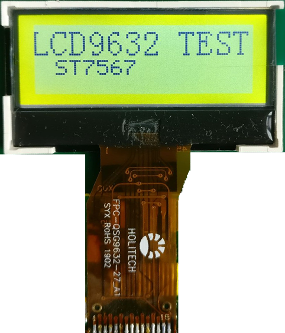

# FPC-QSG9632-27_A1

## pin
| 1 | 2 | 3| 4 | 5 |6 |7|8|9|10|11|12|13|14|15
|--|--|--|--|--|--|--|--|--|--|--|--|--|--|--|
| NC | NC |NC |NC |NC |NC |LED_A |CBS |RSTB |A0 |SCLK |SDA |VDD |VSS |V0 |

## ic 
ST7567  96*32 4-wire spi

## LED
1P1S 3.0v

## Connect
15PIN 0.8mm

## thanks
感谢 祝晓明 提供信息

